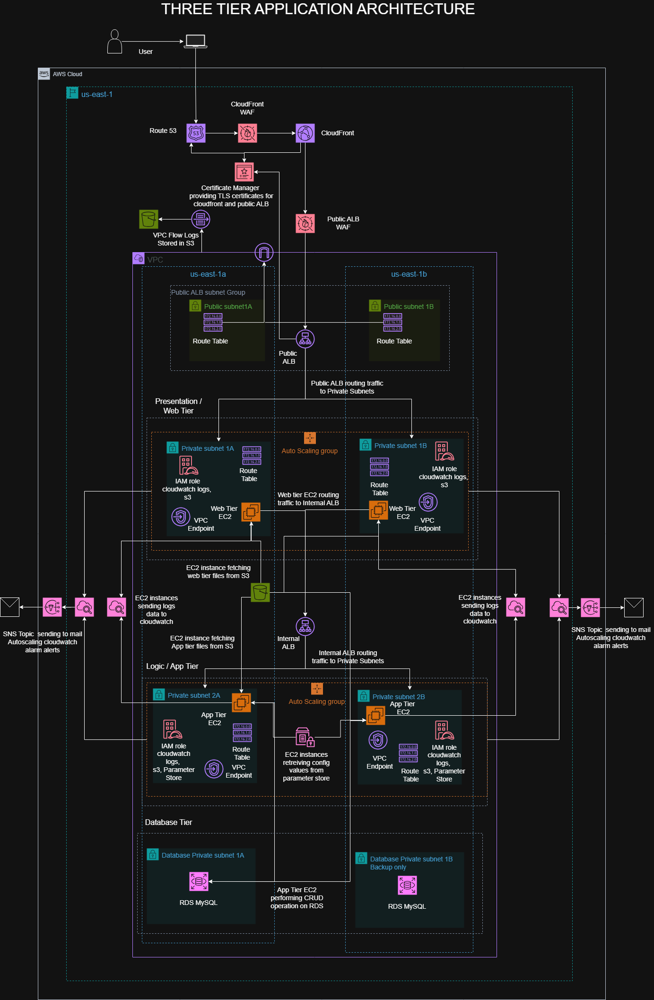

# Three-Tier Application AWS Architecture



# Installation and Running Guide

## Overview

This repository contains Infrastructure as Code (IaC) for automated AWS resource provisioning and configuration using Terraform, Terragrunt, Ansible, and Packer.

**⚠️ Important Notice:**

- Initial deployment takes approximately **45 minutes**
- Resource cleanup takes approximately **25 minutes**
- All operations are logged in `logs/` and `ansible-logs/` directories (created automatically on startup)

---

## Prerequisites

### Required

**Operating System**: any linux distro or git bash on windows, i have used ubuntu in this setup

Ensure the following tools are installed on your system:

| Tool           | Purpose                                   | Installation Link                                                                                     |
| -------------- | ----------------------------------------- | ----------------------------------------------------------------------------------------------------- |
| **AWS CLI**    | AWS credential management and API access  | [Install AWS CLI](https://docs.aws.amazon.com/cli/latest/userguide/getting-started-install.html)      |
| **Terraform**  | Infrastructure provisioning               | [Install Terraform](https://developer.hashicorp.com/terraform/downloads)                              |
| **Terragrunt** | Terraform wrapper for DRY configurations  | [Install Terragrunt](https://terragrunt.gruntwork.io/docs/getting-started/install/)                   |
| **jq**         | JSON processing in scripts                | [Install jq](https://stedolan.github.io/jq/download/)                                                 |
| **Packer**     | Machine image building                    | [Install Packer](https://developer.hashicorp.com/packer/downloads)                                    |
| **Ansible**    | Configuration management and provisioning | [Install Ansible](https://docs.ansible.com/ansible/latest/installation_guide/intro_installation.html) |

### AWS Requirements

- **AWS Account** with appropriate permissions
- **Route 53 Hosted Zone** for your domain (required for DNS configuration)
- **IAM permissions** to create EC2 instances, VPCs, security groups, and other AWS resources

---

## Configuration

### 1. Configure AWS Credentials

Set up your AWS credentials using one of the following methods:

**Option A: AWS CLI Configure (Recommended)**

```bash
aws configure
```

**Option B: Environment Variables**

```bash
export AWS_ACCESS_KEY_ID="your_access_key"
export AWS_SECRET_ACCESS_KEY="your_secret_key"
export AWS_DEFAULT_REGION="us-east-1"
```

**Option C: AWS Credentials File**

```bash
# ~/.aws/credentials
[default]
aws_access_key_id = your_access_key
aws_secret_access_key = your_secret_key
```

### 2. Update Configuration File

Edit the `terraform.tfvars` file with your specific configuration:

```hcl
# terraform.tfvars

# Domain Configuration (must be hosted on AWS Route 53)
certificate_domain_name   = "yourdomain.com"          # domain saved in hosted zone in route 53 and based on which acm certificate is created
additional_domain_name    = "www.yourdomain.com"     # additional domain name to be used to test the app
alb_api_domain_name       = "api.yourdomain.com"      # domain name linked to public load balancer and acm certificate for load balancer

# EC2 Configuration
instance_type = "t4g.small"  # Default: runs on Amazon Linux 2023 arm64 (ec2-user)
region        = "us-east-1"

# Add other configuration parameters as needed
```

**Domain Configuration Notes:**

- `certificate_domain_name`: domain hosted in route53 and acm certificate is created for this domain
- `additional_domain_name`: additional domain on which the app is going to be hosted and tested eg. www.yourdomain.com- `alb_api_domain_name`: API endpoint for Public Application Load Balancer to be used as origin in cloudfront

**⚠️ Domain Requirement:** Your domain must be managed by AWS Route 53 before deployment.

---

## Usage

### Starting Infrastructure

Deploy all AWS resources:

```bash
./scripts/operation.sh startup
```

**What happens during startup:**

- Validates prerequisites and configuration
- Provisions AWS infrastructure via Terraform/Terragrunt
- Builds machine images with Packer
- Configures resources using Ansible
- Sets up DNS records in Route 53
- Creates log directories and begins logging

**Duration:** ~45 minutes

**Test the setup**: in the browser type only `"www.yourdomain.com"` for testing the app

### Destroying Infrastructure

Clean up all AWS resources:

```bash
./scripts/operation.sh cleanup
```

**What happens during cleanup:**

- Removes all provisioned AWS resources
- Deletes DNS records
- Preserves logs for audit purposes

**Duration:** ~25 minutes

---

## Monitoring and Troubleshooting

### Log Files

All operations are logged for debugging and audit purposes:

```
project-root/
├── logs/                          # complete logs of the full operation
├── packer/
│       ├── ansible-logs/          #  Ansible execution logs
│       ├── backend/
│       │   ├── ansible-logs/      # Backend Ansible execution logs
│       │   └── packer-logs/       # Backend Packer build logs
│       └── frontend/
│           ├── ansible-logs/      # Frontend Ansible execution logs
│           └── packer-logs/       # Frontend Packer build logs
└── terraform_{env}/
    └── nat_key/
        └── key/
            └── nat-bastion-key.pem            # SSH private key for nat instance and bastion host EC2 access
```

**Note:** logs/ and ansible-logs/ folders and the respective log files are created automatically when you run `./scripts/operation.sh startup`

- **change the name of log file**: the log file name inside logs/ folder can be changed inside operation.sh script

```bash
# ./scripts/operation.sh
# Determine log file name
case "$operation" in
  startup)
    file_name="startup-log"
    ;;
  cleanup)
    file_name="cleanup-log"
    ;;
  *)
    echo "Error: Invalid operation '$operation'. Use 'startup' or 'cleanup'"
    exit 1
    ;;
esac

```

### SSH Access for Debugging

To SSH into EC2 instances for debugging:

```bash
# Locate your  key
cd terraform/nat_key/key/

# Set correct permissions on the key file
chmod 400 nat-bastion-key.pem

# SSH into your EC2 instance
ssh -i nat-bastion-key.pem ec2-user@<instance-public-ip>
```

**Security Note:** The `nat-bastion-key.pem` file contains sensitive credentials. Never commit this file to version control. in this setup the all the key are destroyed after cleanup by the script itself

### Common Issues

**Issue:** "Domain not found in Route 53"

- **Solution:** Ensure your domain is hosted in Route 53 before running startup

**Issue:** "AWS credentials not configured"

- **Solution:** Run `aws configure` and verify credentials with `aws sts get-caller-identity`

**Issue:** "Permission denied on operation.sh"

- **Solution:** Make the script executable: `chmod +x ./scripts/operation.sh` and other scripts used in operation.sh in scripts folder

**Issue:** "Cannot SSH into EC2 instance"

- **Solution:** Ensure nat-bastion-key.pem has correct permissions: `chmod 400 terraform/nat_key/key/nat-bastion-key.pem`
- Verify security group allows SSH (port 22) from your IP address

**Issue:** "Packer build failures"

- **Solution:** Check logs in `logs/packer/backend/packer-logs/` or `logs/packer/frontend/packer-logs/`
- Verify Ansible playbooks completed successfully in corresponding ansible-logs directories

---

## Default Configuration for ec2 instance

- **Operating System:** Amazon Linux 2023 arm64 (ec2-user)
- **Default Region:** us-east-1
- **Default Instance Type:** t4g.small

---

## Best Practices

1. **Review tfvars:** Always review `terraform.tfvars` before deployment
2. **Cost monitoring:** Monitor AWS costs during the 40-minute deployment
3. **Log retention:** Keep logs for troubleshooting and compliance
4. **Cleanup verification:** Verify all resources are destroyed via AWS Console after cleanup
5. **Version control:** : version control different configurations
6. **Key management:** Store SSH keys securely and rotate regularly

---

## Support and Contribution

For issues, questions, or contributions, please:

- Open an issue in the repository

---

**⏱️ Time Investment Summary:**

- Initial Setup: 10 minutes
- Deployment: 45 minutes
- Cleanup: 25 minutes
- **Total:** ~80 minutes for complete lifecycle
